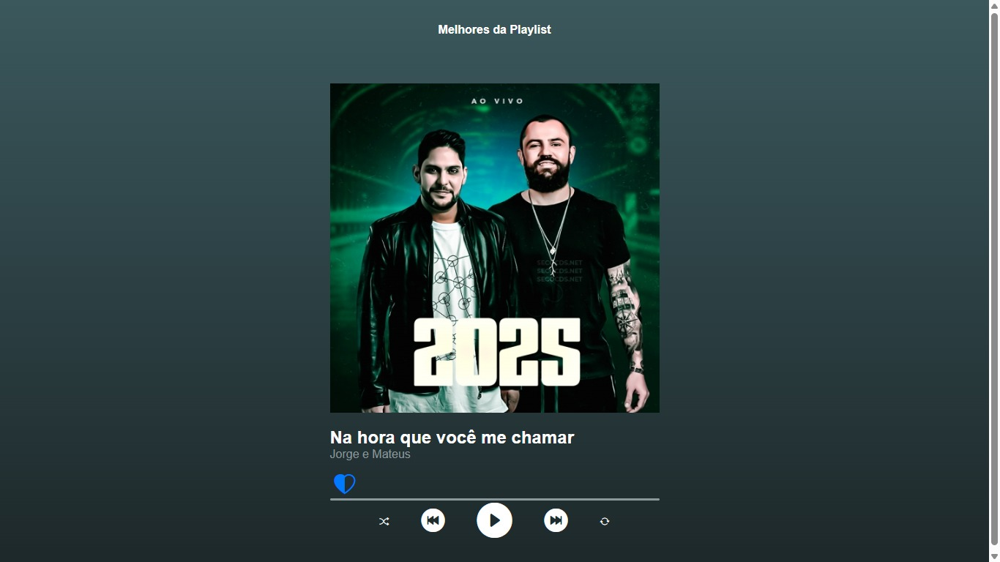
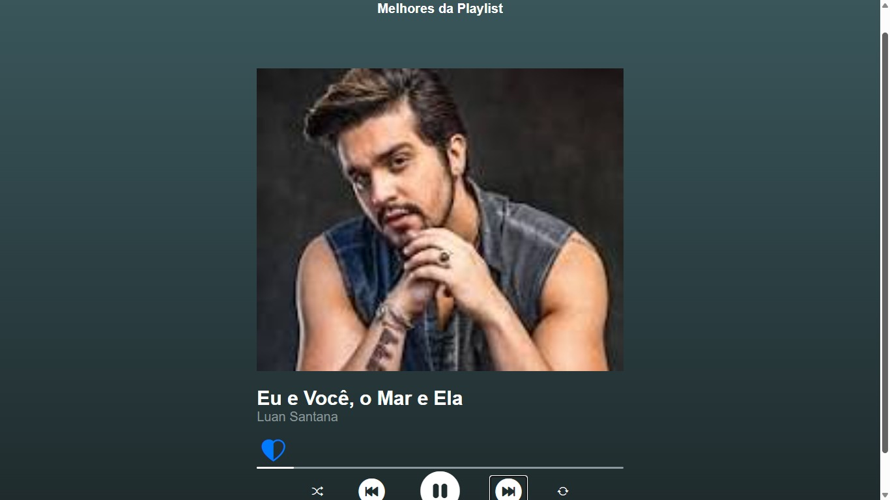
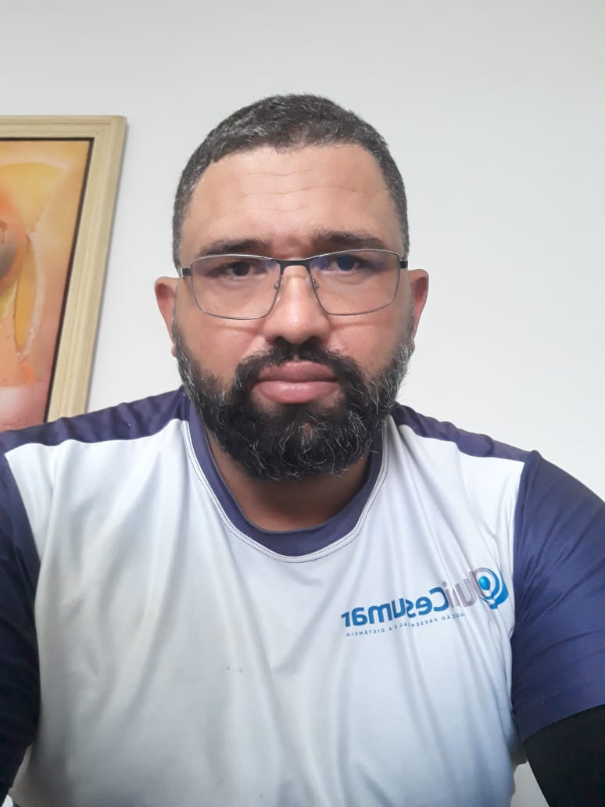

[READM.md](https://github.com/user-attachments/files/23248869/READM.md)
#  Projeto de Sportify 

 É uma playlist de seleção de musicas🎵🎵
 ## Índice
- <a href = "#funcionalidades"> Funcionalidades do projeto</a> 
- <a href = "#Layout">Layout</a> 
- <a href = "#Demonstração">Demonstração</a> 
- <a href = "#Rodar">Como rodar o projeto</a> 
- <a href = "#Tecnologias utilizadas">Tecnologias Utilizadas</a> 
- <a href = "Autoras">Pessoas autoras</a> 
- <a href = "#Passos">Próximos passos</a> 

## 📲funcionalidade do Projeto 

- [X] Play de música 
- [X] Tocar para frente/atrás e atualização de imagem
- [X] Repetir a Música
- [X] Parar a música
- [X] Embaralhar a seleção de música
## Layout

## Demonstração
[Link demonstração](https://dainty-meerkat-862ecd.netlify.app/)
## Como rodar este projeto
 ### Clonar o repositório

### Entrar na pasta do projeto
sportify

### Abrir o projeto no navegador (ou usar Live Server)
#### Se tiver a extensão Live Server do VS Code:
live-server

# Tecnologias Utilizadas 

- **[HTML5](https://developer.mozilla.org/pt-BR/docs/Web/HTML)** – Estrutura do projeto
- **[CSS3](https://developer.mozilla.org/pt-BR/docs/Web/CSS)** – Estilização, layout e responsividade
- **[JavaScript (Vanilla JS)](https://developer.mozilla.org/pt-BR/docs/Web/JavaScript)** – Lógica do player e interação
- **[Bootstrap Icons](https://icons.getbootstrap.com/)** – Ícones dos botões
- **[LocalStorage](https://developer.mozilla.org/pt-BR/docs/Web/API/Window/localStorage)** – Persistência dos likes das músicas
- **[Live Server](https://marketplace.visualstudio.com/items?itemName=ritwickdey.LiveServer)** – Para rodar o projeto em um servidor local

# Pessoas Autoras

()

[Linkedin](https://www.linkedin.com/feed)
# Próximos passos

- [ ] acréscimos de músicas atuais 
